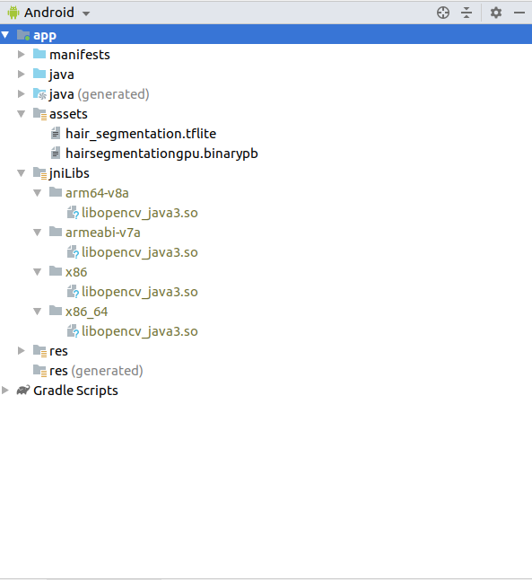
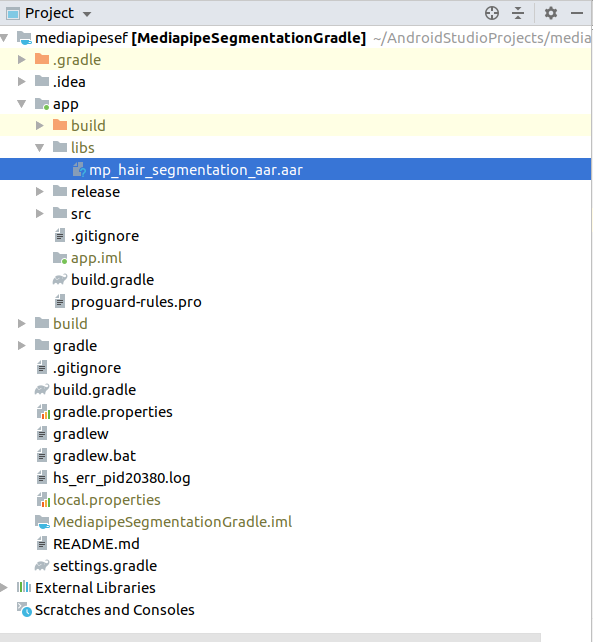

# Mediapipe Segmentation Sample 


# Added Features 

1. Apply mediapipe on local video (mp4 etc.)
2. Customize combine_with_previous_ratio value.
3. Record Mediapipe rendered video.
4. Save log in a file (Mediapipe runtime , Cpu & GPU details).

# How to use 

**Download git repository** 

```
git clone https://github.com/afsaredrisy/SegmentationMediapipe.git
```

**Download OpenCV prebuild binary files and mediapipe arr**

Download the opencv .so file from [this-link](https://github.com/opencv/opencv/releases/download/3.4.3/opencv-3.4.3-android-sdk.zip)
unzip the and copy the corrensponding .so file in app/src/main/jniLibs

Your project should look like this.<br/>
<br/>

Download mediapipe aar from [this-link](https://drive.google.com/open?id=1urxxINE2YqDdZV_Bp7-ORLjD_-n_gz-9) and copy to /app/libs folder.<br/>

<br/>

**Build & Run**

Now you can build the project in Android studio with gradle & can RUN.


**How to change model**

Prebuild binarypb is for following configration

```
input: [224,224] 
output: [224,224]
Number of Channels: 3
```

You need to change input/output & chanel size in segmentation graph according to your tflite model,

To change model copy your tflite file in assets folder with name hair_segmentation.tflite

Note: The model added to this repository is just for demo and not the accurate one, must use your own tflite file.
